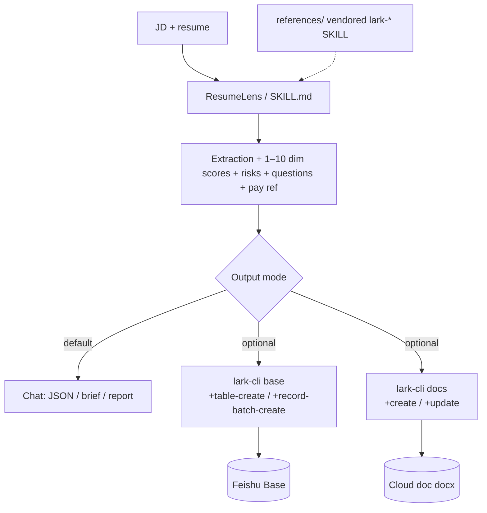

<div align="center">
  <h1>ResumeLens</h1>
  <p>
    <strong>Line up the JD and the resume—first-pass review you can compare</strong><br>
    In chat, get a <strong>structured first-pass review</strong>: dimension scores, risks, follow-up questions, and pay reference. The skill <strong>supports Feishu</strong>: with your app and permissions set up, use <a href="https://www.npmjs.com/package/@larksuite/cli">lark-cli</a> to write to <strong>Base</strong> (spreadsheet) or <strong>cloud documents</strong>. Feishu steps, scopes, and “template A” live in <a href="./SKILL.md">SKILL.md</a>.
  </p>
</div>

<p align="center">
  <a href="./README.en.md"></a>
  <a href="./README.md"></a>
</p>

<p align="center">
  <a href="./LICENSE"></a>
  
  <a href="https://github.com/larksuite/cli"></a>
  
  
</p>

⬇️ [简体中文](./README.md) · `skill` · `resume` · `lark-cli` · `agent-agnostic`

---

<details open>
<summary><b>Table of contents</b></summary>

- [What it solves](#what-it-solves)
- [Before / After](#before--after)
- [One-liner usage](#one-liner-usage)
- [Architecture](#architecture)
- [Install](#install)
- [How to use](#how-to-use)
- [Example prompts](#example-prompts)
- [Repository layout](#repository-layout)
- [Dependencies](#dependencies)
- [Agent compatibility](#agent-compatibility)
- [Disclaimer](#disclaimer)
- [Contributing & license](#contributing--license)

</details>

## What it solves

In early screening you need **fast, comparable, traceable** views of a candidate: dimension scores, risks, follow-up questions, and rough pay bands. If you need those results **in Feishu**—**Base** for filtering and rollups or **cloud docs** for stakeholders—you also want **less copy-paste** and a **clear audit trail**.

**ResumeLens** encodes rubrics, standard JSON, and how Feishu writes work in a single [`SKILL.md`](./SKILL.md). For real exports, the agent should run **`lark-cli`** and keep verifiable output (links or errors), per `SKILL.md`.

## Before / After

| | Chat-only assessment | Chat + Feishu (this skill) |
|---|:---:|:---:|
| **In-thread output** | Multi-dim scores, risks, questions, pay reference, etc. | Same as the left column (see `SKILL.md`); with optional Base / cloud doc writes after you confirm |
| **Into Base** | Manual entry, error-prone | `lark-cli base` create table / batch write; fields per “Template A” |
| **Archived report** | Copy-paste, inconsistent | `lark-cli docs` create or append Markdown |
| **Auditable** | Relies on screenshots / paste | CLI exit output, URLs, error messages |
| **Offline CLI help** | Often need online docs | This repo’s [`references/`](./references/) includes vendored `lark-*` `SKILL.md` copies |

> **Chat-only, no Feishu:** you do **not** need to run `lark-cli`. `references/` still helps the agent with commands and scopes.

## One-liner usage

```
Screen this resume against the JD below; output standard JSON. If I confirm Feishu, write the result to my Base or cloud doc.
```

Clarify the delivery mode:

- **JSON / brief / long report in chat** → no `lark-cli` required.
- **Base** → supply or authorize `base_token` / `table_id` (see [SKILL.md](./SKILL.md), workflow **D** — write to Feishu Base).
- **Cloud doc** → `docs +create` or `+update` on an existing doc; **Wiki** URLs need node resolution (see [SKILL.md](./SKILL.md) and [`references/lark-wiki/`](./references/lark-wiki/SKILL.md)).

## Architecture



## Install

### Prerequisites

- An agent that supports the [SKILL.md convention](https://docs.anthropic.com/en/docs/claude-code/skills) (see [Agent compatibility](#agent-compatibility))
- For Feishu writes: **[Node.js](https://nodejs.org/)** and a working **`@larksuite/cli`** (`lark-cli`) install (e.g. `npm i -g` or any setup where `lark-cli` is on your `PATH`)
- A Feishu developer app and user / app auth (scopes per console and CLI error hints)

### How to add this skill

**Recommended:** add this directory to your agent’s **skills scan path**, or clone into your project.

```bash
git clone https://github.com/Lucky2024-pllove/ResumeLens.git
```

Place `ResumeLens` in the **current project** or the **global skills folder** (paths differ by product—use your client’s docs).

### First run (when writing to Feishu)

Standard CLI flow, e.g.:

```bash
npm i -g @larksuite/cli
lark-cli config init --new
lark-cli auth login --scope "<scopes from dev console or error message>"
```

Add `--as user` when using user identity. For details see [`references/lark-shared/SKILL.md`](./references/lark-shared/SKILL.md) or the `lark-shared` skill shipped with `lark-cli`.

## How to use

### 1. Conclusions in chat only (no Feishu)

Provide full resume + structured JD. Say you want **only** JSON / brief / long report in the thread—**do not** run `lark-cli`.

### 2. Write to Base (bitable)

1. Confirm `base_token` and `table_id`, or use `+base-create` / `+table-create` per [SKILL.md](./SKILL.md) (confirm before writes).
2. Align columns with **Template A** in `SKILL.md`; use `--fields` JSON when creating the table.
3. Batch example (max 200 rows per batch; use `+field-list` to verify column names and types first):

```bash
lark-cli base +record-batch-create \
  --as user \
  --base-token bascnXXXXXXXX \
  --table-id tblXXXXXXXX \
  --json '{"fields":["Name","Score","Summary"],"rows":[["Alice",8.1,"Strong match; verify project duration"]]}'
```

Complex cell payloads: see [`references/lark-base/references/lark-base-shortcut-record-value.md`](./references/lark-base/references/lark-base-shortcut-record-value.md).

### 3. Write to cloud docs

Create a new doc:

```bash
lark-cli docs +create --as user \
  --title "Screening-20260421" \
  --markdown $'## Summary\n\n- Role: ...\n- Count: ...\n\n## Ranking\n\n...'
```

Append to an existing doc:

```bash
lark-cli docs +update --as user \
  --doc doxcnXXXXXXXX \
  --mode append \
  --markdown $'## Candidate B\n\n...'
```

**Wiki** URLs (`/wiki/...`) need `obj_token` resolution via `lark-cli wiki`—see [SKILL.md](./SKILL.md) and [`references/lark-wiki/SKILL.md`](./references/lark-wiki/SKILL.md).

## Example prompts

| Goal | Example |
|------|---------|
| JSON only | Role: senior backend, 5+ years Go, … Resume: “…” Output standard JSON from `SKILL.md`; **do not** write to Feishu. |
| Write Base | Same content. Use `lark-cli` to write to Base, `base_token` …, `table_id` …; run `+field-list` then `+record-batch-create`. |
| New doc | Screen three resumes, produce a Markdown report, and `lark-cli docs +create` with title “Data screening-YYYYMMDD”. |

## Repository layout

| Path | Description |
|------|-------------|
| [`SKILL.md`](./SKILL.md) | Main skill: workflow, rubric, standard JSON format, mandatory Feishu steps, scope table |
| [`references/`](./references/) | Vendored `lark-*` `SKILL.md` copies + Base record-value helper for offline use |
| [`references/README.md`](./references/README.md) | Source paths and re-sync notes |
| [`demo/`](./demo/) | Fictional resume/JD/sample JSON—see [`demo/README.md`](./demo/README.md) |
| [`README.md`](./README.md) | Chinese README |
| [`LICENSE`](./LICENSE) | MIT |

## Dependencies

| Dependency | Role | Required? |
|------------|------|-----------|
| Agent with `SKILL.md` | Load and follow this skill | **Yes** (chat use) |
| [`lark-cli`](https://github.com/larksuite/cli) | Base / doc writes | Only when **delivering to Feishu** |
| Feishu app + auth | API / user access | Only when **delivering to Feishu** |

This repo does **not** ship `lark-cli` source; it only documents command-line usage.

## Agent compatibility

This is a standard `SKILL.md` package. Typical placement: **project root** or **global skills** (e.g. `~/.claude/skills/`, or Cursor’s configured path—see each product’s documentation).

## Disclaimer

Output is **assistant screening information only**—**not** legal advice, hiring advice, or a hiring commitment. Pay bands and hire/no-hire must be decided by HR and the line org using company policy and market data.

## Contributing & license

- Published under [**MIT**](./LICENSE); internal or commercial use is fine if you keep the license notice.
- Issues / PRs welcome for doc fixes, `lark-cli` compatibility notes, and extra examples.
