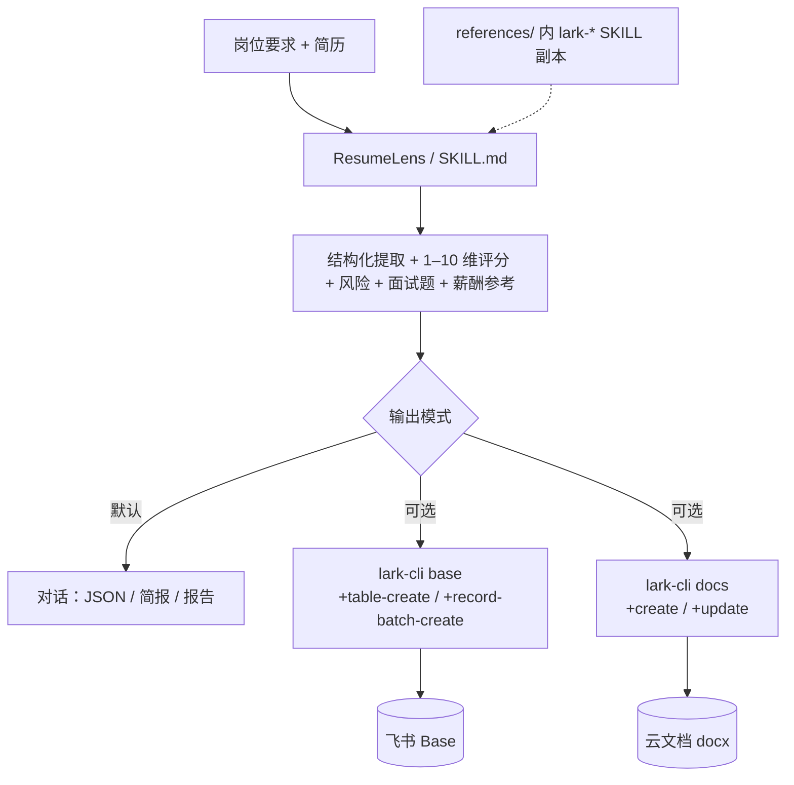

<div align="center">
  <h1>ResumeLens</h1>
  <p>
    <strong>智能简历初审 × 飞书 CLI 落地</strong><br>
    对简历做结构化评估、风险与面试题、薪酬参考；需要时通过 <a href="https://www.npmjs.com/package/@larksuite/cli">lark-cli</a> 将结果写入多维表格（Base）或云文档（docs），禁止「假装已写入」。
  </p>
</div>

<p align="center">
  <a href="./README.en.md"></a>
  <a href="./README.md"></a>
</p>

<p align="center">
  <a href="./LICENSE"></a>
  
  <a href="https://github.com/larksuite/cli"></a>
  
  
</p>

<p align="center">
  <a href="https://github.com/Lucky2024-pllove/ResumeLens">仓库</a> |
  <a href="https://github.com/larksuite/cli">lark-cli</a> |
  <a href="https://github.com/Lucky2024-pllove/ResumeLens/issues">Issues</a>
</p>

---

<details open>
<summary><b>目录</b></summary>

- [它解决什么问题](#它解决什么问题)
- [Before / After](#before--after)
- [一句话怎么用](#一句话怎么用)
- [架构](#架构)
- [安装](#安装)
- [使用方式](#使用方式)
- [示例对话](#示例对话)
- [文件结构](#文件结构)
- [依赖](#依赖)
- [兼容 Agent](#兼容-agent)
- [免责声明](#免责声明)
- [贡献与许可证](#贡献与许可证)

</details>

## 它解决什么问题

初筛阶段要在对话里**快速、可比、可追溯**地看清候选人：维得分、风险点、面试追问、大致薪酬区间。若团队用飞书沉淀数据，还希望**直接写入 Base 做筛选统计**，或**写入云文档**给业务方阅评——但手动复制粘贴易错、无审计。

**ResumeLens** 用一份 [`SKILL.md`](./SKILL.md) 约定评分口径、JSON 与飞书写入流程；在需要落地飞书时，**必须通过 `lark-cli` 真实执行**并回传结果链接或错误，而不是口头声称已保存。

## Before / After

| | 纯聊天评估 | 聊天 + 飞书落地（本技能） |
|---|:---:|:---:|
| **初筛输出（会话内）** | 多维度分、风险、面试题、薪酬参考等 | 与左列相同（口径见 `SKILL.md`），并可在确认后写入 Base / 云文档 |
| **进多维表格** | 手工填表、易错 | `lark-cli base` 建表/批写，字段见「模板 A」 |
| **出归档报告** | 复制到文档、格式不统一 | `lark-cli docs` 新建/追加 Markdown |
| **可审计** | 依赖截屏/粘贴 | CLI 回执、链接、失败原因可查 |
| **离线 CLI 帮助** | 常需联网查文档 | 本仓库 [`references/`](./references/) 自带 `lark-*` 技能 `SKILL.md` 副本 |

> **仅聊天、不写飞书**时不需要执行 `lark-cli`；`references/` 仍可帮助 Agent 理解命令与权限。

## 一句话怎么用

```
帮我对照这份 JD 初筛下面这份简历，输出标准 JSON；若我确认写入飞书，再写入我的 Base / 云文档。
```

也可以直接说明输出形态：

- 只要会话内 **JSON / 简报 / 详细报告** → 无需 `lark-cli`。
- 要 **Base** → 提供或授权创建 `base_token` / `table_id`（见 [`SKILL.md`](./SKILL.md) 第四节）。
- 要 **云文档** → 新建 `docs +create` 或 `+update` 追加到已有 `doc`；Wiki 链需先解析节点（见 `SKILL.md` 与 [`references/lark-wiki/`](./references/lark-wiki/SKILL.md)）。

## 架构



## 安装

### 前置条件

- 支持 [SKILL.md 规范](https://docs.anthropic.com/en/docs/claude-code/skills) 的 Agent（[兼容 Agent](#兼容-agent)）
- 若需写入飞书：**[Node.js](https://nodejs.org/)** + 全局或可用的 **[`@larksuite/cli`](https://www.npmjs.com/package/@larksuite/cli)**（`lark-cli`）
- 飞书自建应用及用户/应用授权（scope 以控制台与 CLI 错误提示为准）

### 安装方式

**推荐：将本目录加入 Agent 的 skills 扫描路径**，或把本仓库作为子模块/拷贝进项目使用。

```bash
git clone https://github.com/Lucky2024-pllove/ResumeLens.git
```

将 `ResumeLens` 放在**当前项目目录**或 **Agent 全局 skills 目录**（各工具路径不同，以所用客户端为准）。

### 首次使用（写入飞书时）

与官方 CLI 一致，例如：

```bash
npm i -g @larksuite/cli
lark-cli config init --new
lark-cli auth login --scope "<按开发者控制台或错误提示补齐的 scope>"
```

默认用户身份可在命令后加 `--as user`。更细的权限与 `auth login` 说明见本仓库 [`references/lark-shared/SKILL.md`](./references/lark-shared/SKILL.md) 或随 `lark-cli` 分发的 `lark-shared` 技能包。

## 使用方式

### 1. 仅在对话中出结论（不写飞书）

提供简历全文或附件 + 结构化岗位要求。说明**只在聊天里**输出 JSON / 简报 / 详细报告即可，**不执行** `lark-cli`。

### 2. 写入多维表格（Base）

1. 确认 `base_token` 与 `table_id`，或按 [`SKILL.md`](./SKILL.md) 让 Agent 使用 `+base-create` / `+table-create`（写入前需确认）。
2. 字段建议与 `SKILL.md` 中**飞书落地模板 A** 对齐；创建表时用 `--fields` JSON。
3. 批量写入示例（每批最多 200 行；写入前用 `+field-list` 核对列名与类型）：

```bash
lark-cli base +record-batch-create \
  --as user \
  --base-token bascnXXXXXXXX \
  --table-id tblXXXXXXXX \
  --json '{"fields":["姓名","综合得分","核心评价"],"rows":[["张三",8.1,"匹配度高，需核实某项目时长"]]}'
```

复杂字段的记录值格式见 [`references/lark-base/references/lark-base-shortcut-record-value.md`](./references/lark-base/references/lark-base-shortcut-record-value.md)。

### 3. 写入云文档（docs）

新建报告：

```bash
lark-cli docs +create --as user \
  --title "Java岗-简历初审-20260421" \
  --markdown $'## 摘要\n\n- 岗位：...\n- 本批人数：...\n\n## 排名\n\n...'
```

向已有文档追加：

```bash
lark-cli docs +update --as user \
  --doc doxcnXXXXXXXX \
  --mode append \
  --markdown $'## 候选人 B\n\n（结构化正文）'
```

**Wiki 链接**（`/wiki/...`）需先通过 `lark-cli wiki` 等解析真实 `obj_token`，见 [`SKILL.md`](./SKILL.md) 与 [`references/lark-wiki/SKILL.md`](./references/lark-wiki/SKILL.md)。

## 示例对话

| 目标 | 示例提示 |
|------|----------|
| 仅 JSON | 岗位：高级后端，5 年+ Go……简历：「……」请按 `SKILL.md` 标准 JSON 输出，**不要**写飞书。 |
| 写 Base | 同上。请用 `lark-cli` 写入 Base，`base_token` …，`table_id` …；先 `+field-list` 再 `+record-batch-create`。 |
| 新建云文档 | 三份简历初评，整理成 Markdown 报告，并用 `lark-cli docs +create` 新建文档，标题「数据岗初筛-YYYYMMDD」。 |

## 文件结构

| 路径 | 说明 |
|------|------|
| [`SKILL.md`](./SKILL.md) | 主技能：工作流、评分规则、标准 JSON、飞书 CLI 强制步骤、权限表 |
| [`references/`](./references/) | 随仓 `lark-shared` / `lark-base` / `lark-doc` / `lark-wiki` 的 `SKILL.md` 副本 + Base 记录值速查，便于离线 |
| [`references/README.md`](./references/README.md) | 副本来源与同步说明 |
| [`demo/`](./demo/) | 虚构简历、JD、与 JSON 对齐的样例，见 [`demo/README.md`](./demo/README.md) |
| [`README.en.md`](./README.en.md) | 英文版说明 |
| [`LICENSE`](./LICENSE) | MIT |

## 依赖

| 依赖 | 用途 | 必需？ |
|------|------|--------|
| 支持 `SKILL.md` 的 Agent | 解析并执行本技能 | **是**（对话场景） |
| [`lark-cli`](https://github.com/larksuite/cli)（`@larksuite/cli`） | 写入飞书 Base / 云文档 | 仅**需要落地飞书**时必需 |
| 飞书应用与授权 | 调用开放 API / 用户态 | 仅**需要落地飞书**时必需 |

本仓库**不包含** `lark-cli` 源码，仅文档与技能约定中引用其命令行行为。

## 兼容 Agent

本技能为开放 `SKILL.md` 形式，不绑定单一平台。常见用法：将本仓库置于 **项目目录** 或 **全局 skills 目录**（如 Claude Code 的 `~/.claude/skills/`、Cursor 配置的 skills 路径等，以各产品文档为准）。

## 免责声明

本 Skill 输出为 **招聘初筛辅助信息**，**不构成**法律意见或录用承诺；薪酬与是否录用需由 HR 与用人部门结合公司政策与市场数据**最终**决定。

## 贡献与许可证

- 以 [**MIT**](./LICENSE) 发布；保留许可证声明即可在内部或商业场景使用。
- 欢迎通过 Issue / PR 修正文档、补充与新版 `lark-cli` 的兼容说明或示例命令。
